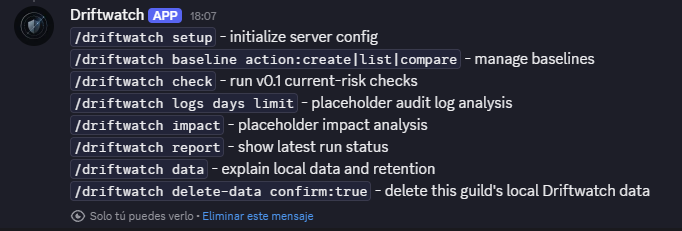
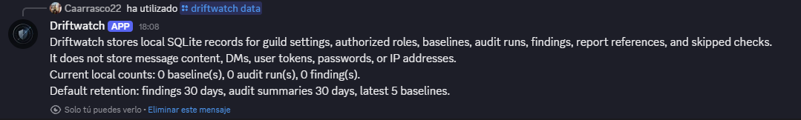
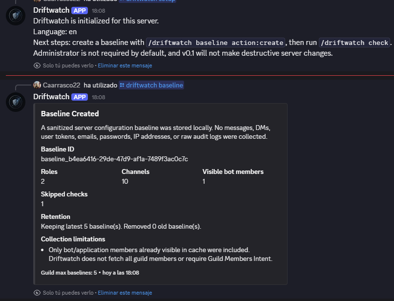
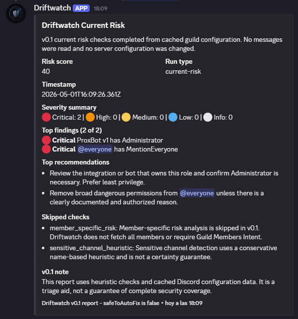
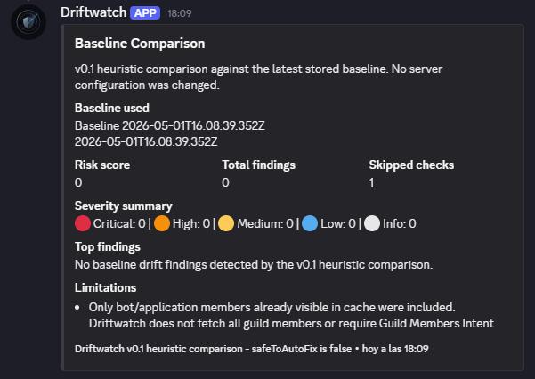
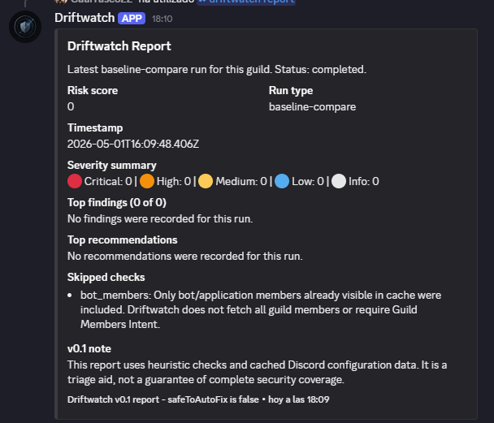

# Discord Driftwatch

Driftwatch helps you detect when your Discord server is no longer as secure as you think it is.

Driftwatch te ayuda a detectar cuando tu servidor de Discord ya no es tan seguro como crees.

## Short Description

Discord Driftwatch is a source-available Discord security auditing bot for authorized defensive administration. It focuses on configuration drift, risky permissions, role and channel exposure, bot access, webhooks, invites, audit log signals, risk scoring, and practical reports.

In short, Driftwatch is designed as a defensive security auditing tool for Discord. Its goal is to help owners and administrators detect security drift, dangerous permissions, critical changes, unnecessary exposure, and early risk signals inside their servers. v0.1 is still early, but it already provides a practical foundation for review, reference, and change monitoring.

### Resumen en espanol

En pocas palabras: Driftwatch esta disenado como una herramienta de auditoria defensiva para Discord. Ayuda a owners y administradores a revisar permisos peligrosos, cambios sensibles, exposicion innecesaria y senales de riesgo dentro del servidor. No es un bot de moderacion generico ni una herramienta ofensiva.

## Status

Driftwatch is early v0.1 and is not a finished security product.

Current state:

- Runnable bot skeleton and slash command structure exist.
- Local SQLite storage exists.
- Baseline create, list, and compare exist.
- Current risk checks exist in v0.1 heuristic form.
- Safe audit log analysis exists in early v0.1 form.
- Stored reports exist for current-risk, baseline-compare, logs, and latest runs.
- Data/privacy commands exist.
- Impact analysis is still experimental/placeholder.
- Auto-fix is not implemented.
- Driftwatch does not modify server configuration in v0.1.

### Nota en espanol

Ahora mismo Driftwatch es una base funcional temprana para auditoria defensiva. Ayuda a revisar y priorizar, pero no certifica que un servidor sea seguro.

## Why Driftwatch Exists

Discord security often drifts slowly. A server may look stable from the outside while important assumptions quietly change:

- A role gains one dangerous permission.
- A bot gets too much access.
- A staff channel becomes visible.
- A webhook appears in a sensitive channel.
- An invite has no limits.
- Many admin actions happen in a short time.

Most servers are not perfectly configured when Driftwatch is installed. Many already have old roles, messy permissions, forgotten invites, old bots, old webhooks, and unclear channel overwrites.

## Recommended Usage Flow

Most servers are not perfectly configured when Driftwatch is installed. Do not create a baseline as proof that the server is safe. A baseline is only a reference point.

1. Run `/driftwatch setup`.
2. Run `/driftwatch check` to review current visible risks.
3. Run `/driftwatch logs` to review recent administrative activity.
4. Manually review and fix what matters.
5. When the server is in an accepted state, run `/driftwatch baseline action:create`.
6. Later, run `/driftwatch baseline action:compare` to detect drift from that accepted reference.

First review. Then set a reference. Then monitor changes.

## Guia de uso recomendada

La mayoria de servidores no estan perfectamente configurados cuando instalas Driftwatch. No crees un baseline como si fuera una prueba de seguridad. Un baseline solo es una referencia del estado actual.

1. Ejecuta `/driftwatch setup`.
2. Ejecuta `/driftwatch check` para revisar riesgos actuales visibles.
3. Ejecuta `/driftwatch logs` para revisar actividad administrativa reciente.
4. Revisa y corrige manualmente lo importante.
5. Cuando el servidor este en un estado aceptado, ejecuta `/driftwatch baseline action:create`.
6. Mas adelante, usa `/driftwatch baseline action:compare` para detectar desviaciones respecto a esa referencia aceptada.

Primero revisa. Luego fija una referencia. Despues vigila cambios.

## Three Pillars

### Current state - `/driftwatch check`

Answers: "What risks are visible right now?"

### Accepted reference / drift - `/driftwatch baseline action:create|compare`

Answers: "What changed compared with the state you accepted?"

### Recent administrative activity - `/driftwatch logs`

Answers: "What happened recently in the audit log?"

## Tres pilares

### Estado actual - `/driftwatch check`

Responde: "Que riesgos visibles hay ahora mismo?"

### Referencia aceptada / drift - `/driftwatch baseline action:create|compare`

Responde: "Que cambio respecto al estado que aceptaste?"

### Actividad administrativa reciente - `/driftwatch logs`

Responde: "Que ha pasado recientemente en el audit log?"

## What Driftwatch Is Not

- Not a traditional anti-raid bot.
- Not a general moderation bot.
- Not an offensive security tool.
- Not a spam, phishing, or token theft tool.
- Not a selfbot.
- Not a replacement for AutoMod, Wick, Dyno, Carl-bot, or similar moderation bots.
- Does not use user tokens.
- Does not try to bypass Discord rate limits.
- Does not automatically modify the server in v0.1.

## Current Capabilities

- Registers `/driftwatch`.
- Initializes local SQLite storage.
- Provides setup, baseline, check, logs, impact, report, data, delete-data, and help command flow.
- Creates sanitized baselines from cached guild configuration.
- Lists stored baselines.
- Compares the latest accepted baseline reference against current cached guild configuration.
- Runs v0.1 current-risk checks for dangerous role permissions, everyone exposure, managed roles, and sensitive-looking channel overwrites.
- Runs safe v0.1 audit log analysis through official Discord audit log APIs.
- Builds Discord embed reports from stored audit runs and findings.
- Stores derived findings, audit run summaries, skipped checks, and report references locally in SQLite.
- Uses a simple heuristic risk score.
- Keeps `safeToAutoFix` false for all findings.

Still experimental:

- `/driftwatch impact` is not a complete diagnostic yet.
- Advanced drift logic is still evolving.
- Audit log intelligence is useful but still heuristic and limited by Discord audit log availability.

## Screenshots / Capturas

These screenshots show an early v0.1 Discord test flow. They may show an earlier v0.1 flow and will be refreshed as the output evolves.

Las capturas pueden mostrar un flujo anterior de v0.1 y se actualizaran conforme evolucione la salida.

### Help command



### Local data and retention summary



### Baseline creation



### Current risk check



### Baseline comparison



### Latest report



## Commands

First steps:

```text
/driftwatch setup
/driftwatch check
/driftwatch logs
```

Reference and drift:

```text
/driftwatch baseline action:create
/driftwatch baseline action:list
/driftwatch baseline action:compare
```

Reports and privacy:

```text
/driftwatch report source:latest
/driftwatch report source:current-risk
/driftwatch report source:baseline-compare
/driftwatch report source:logs
/driftwatch data
/driftwatch delete-data confirm:true
/driftwatch help
```

Experimental:

```text
/driftwatch impact
```

`impact` is still experimental and should not be treated as a complete diagnostic.

Sensitive commands require the guild owner, Administrator permission, Manage Server permission, or a configured authorized role. `/driftwatch delete-data` requires explicit confirmation before local guild data is deleted.

## Permissions

Minimum permissions:

- View Channels
- Send Messages
- Embed Links
- View Audit Log

Optional permissions:

- Manage Guild for deeper invite analysis when required.
- Manage Webhooks for deeper webhook analysis when required.
- Manage Channels only if creating a private report channel.

Administrator is not required by default. Missing optional permissions should become skipped checks, not hard failures.

## Gateway Intents

Required:

- Guilds

Avoid:

- Message Content
- Guild Presences
- Guild Members, unless a future documented feature clearly requires it.

## Data And Privacy

Driftwatch stores:

- Guild ID.
- Bot settings.
- Sanitized baselines.
- Audit run summaries.
- Derived finding summaries.
- Skipped checks.
- Report message references.
- Timestamps.
- Retention settings.

Driftwatch does not store:

- Message content.
- DMs.
- User tokens.
- Passwords.
- Emails.
- IP addresses.
- Raw audit log objects.
- Full Discord object dumps.
- Unnecessary personal data.

### Nota en espanol

Driftwatch no esta disenado para leer conversaciones ni recopilar datos personales innecesarios.

## Installation / Quick Start

```bash
./install.sh
cp .env.example .env
nano .env
npm run doctor
npm run deploy-commands
npm start
```

`npm run doctor` checks the local self-hosting setup before deploy/start: Node.js, dependencies, `.env`, required variables, and SQLite path readiness. It does not connect to Discord or verify server permissions.

On Windows, use Git Bash or WSL for shell scripts, or run the npm commands manually. `.env` must be filled before deploying commands or starting the bot.

For a fuller server setup guide, see [docs/self-hosting.md](docs/self-hosting.md).

After installation, test the first-use flow in Discord:

```text
/driftwatch setup
/driftwatch check
/driftwatch logs
/driftwatch baseline action:create
/driftwatch report source:latest
```

Create the baseline only after reviewing current risks and accepting the current state as a reasonable reference.

Before using Driftwatch on any important server, test the v0.1 flow in a private Discord server. See [docs/testing.md](docs/testing.md).

## Development Validation

Before opening a pull request or pushing changes, run:

```bash
npm run validate
```

`npm run validate` checks JavaScript syntax, CommonJS module loading, required project files, and basic safety guards. It does not login to Discord, does not require `.env`, does not deploy slash commands, and does not start the bot.

## Environment Variables

```text
DISCORD_TOKEN=
DISCORD_CLIENT_ID=
DISCORD_GUILD_ID=
DATABASE_PATH=./data/driftwatch.sqlite
LOG_LEVEL=info
DEFAULT_LANGUAGE=en
```

## Updating

```bash
./update.sh
```

The update script runs `git pull` and `npm install`. It deploys commands only when the required environment variables are configured.

## Repository Structure

```text
docs/
src/commands/
src/baseline/
src/audits/
src/engines/
src/reports/
src/db/
src/utils/
```

## Roadmap

v0.1:

- Continue improving baseline create, list, and compare.
- Continue improving current risk checks.
- Continue improving safe audit log analysis.
- Keep improving reports and skipped-check summaries.
- Keep impact analysis marked as experimental until it is useful.

v0.2:

- Markdown export.
- Better sensitive channel detection.
- Configurable rules.
- Report history.
- Improved i18n.

Future:

- PostgreSQL.
- Dashboard.
- Closed beta hosting.
- App Directory preparation.
- PDF export.
- Member-specific analysis only if justified and privacy-safe.

## License

Driftwatch is source-available and restricted-use. It is not open source. It is for authorized defensive use only.

The license does not permit raids, spam, phishing, token theft, selfbots, rate-limit evasion, unauthorized actions, resale, or SaaS use without permission.

See [LICENSE.md](LICENSE.md) for the full license terms.

## Disclaimer

Users are responsible for complying with the Discord Developer Terms, Discord Developer Policy, applicable laws, hosting rules, and the rules of any server where Driftwatch is installed. Only use Driftwatch for authorized defensive auditing.
